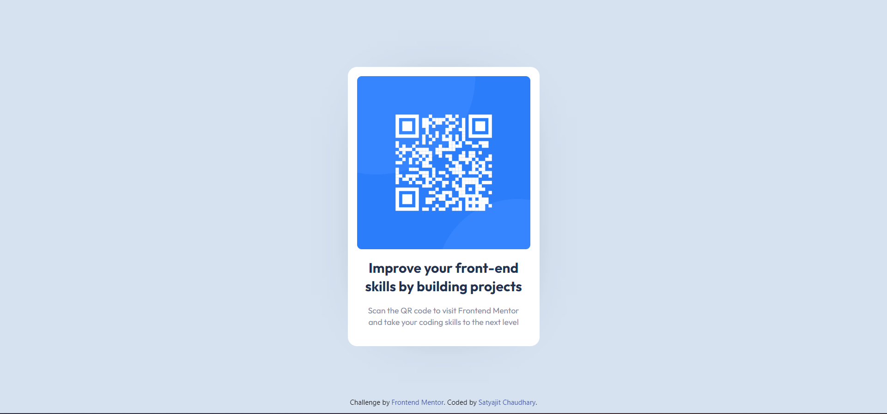

# Frontend Mentor - QR code component solution

This is a solution to the [QR code component challenge on Frontend Mentor](https://www.frontendmentor.io/challenges/qr-code-component-iux_sIO_H).

## Table of contents

- [Overview](#overview)
  - [Screenshot](#screenshot)
  - [Links](#links)
- [My process](#my-process)
  - [Built with](#built-with)
  - [Useful resources](#useful-resources)
- [Author](#author)

## Overview

### Screenshot

### Links

- Solution URL: [https://github.com/iamsatyajit05/QR-code-component](https://github.com/iamsatyajit05/QR-code-component)
- Live Site URL: [https://iamsatyajit05.github.io/QR-code-component/](https://iamsatyajit05.github.io/QR-code-component/)

## My process

### Built with

- HTML and TailwindCSS

### Useful resources

There are many Box Shadow Generator we can use but I used [cssmatic](https://www.cssmatic.com/box-shadow)

## Author

- Twitter - [@0xSatyajit](https://www.twitter.com/0xSatyajit)
- LinkedIn - [@iamsatyajit](https://www.linkedin.com/in/iamsatyajit)
- Frontend Mentor - [@iamsatyajit05](https://www.frontendmentor.io/profile/iamsatyajit05)